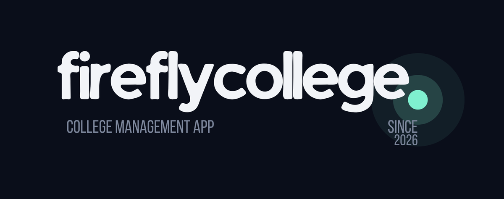

<p align="center">
  
</p>

# FireflyCollege

A local-first college organizer for Android — courses, assignments, and deadlines in one
dark, firefly-lit place. Built as a personal tool and programming portfolio project.

> *"Struktur data — tugas linked list. Deadline: tomorrow. Incomplete."*
> FireflyCollege makes that sentence impossible to miss.

The visual identity takes subtle inspiration from Firefly (Honkai: Star Rail): a night-sky
palette, glowing green/cyan accents, and a few drifting fireflies in the empty states —
while staying a serious, usable productivity app.

## Features

**Prototype (current):**

- **Dashboard** — greeting, overdue / due-today / due-this-week counters, assignment
  sections prioritized by urgency, course overview strip
- **Courses** — name, lecturer (optional), room (optional), color tag; course pages with
  per-course assignment progress
- **Assignments** — title, description, course, deadline (date + time), priority,
  optional notes, completion toggle with through-line animation, delete with confirmation
- **Deadline awareness** — every card shows a human countdown: *"due tomorrow"*, *"in 12h 30m"*, *"2 days overdue"*
- **Local-first** — everything lives in an on-device Room database; no account, no server, no internet
- **Dark mode** — night palette by default, follows system light/dark
- Adaptive launcher icon drawn from the project logo

**Roadmap (later stages):**

- Calendar view (tap a date → that day's tasks)
- Search across assignments and courses
- Local deadline notifications via AlarmManager
- Settings with theme toggle (DataStore)
- JSON export/import backup
- Firefly polish: transitions, Lottie accents, accessibility pass

## Build (no Android Studio required)

The project is a plain Gradle/Kotlin Android project — Android Studio is *not* needed.
Requirements:

1. **JDK 17+** (21 works)
2. **Android SDK** — command-line tools are enough; packages used: `platforms;android-36`, `build-tools;36.0.0`
3. Point Gradle at your SDK via `local.properties` (gitignored) in the repo root:

   ```properties
   sdk.dir=C:/path/to/Android/Sdk
   ```

4. Build:

   ```bash
   ./gradlew assembleDebug        # Linux/macOS
   gradlew.bat assembleDebug      # Windows
   ```

5. The debug APK appears at `app/build/outputs/apk/debug/app-debug.apk`.

Minimum Android version: 8.0 (API 26).

## Project structure

```text
app/src/main/java/com/fyrefly/fireflycollege/
├── data/
│   ├── database/        # Room database + converters
│   ├── dao/             # Room DAOs
│   ├── entities/        # Room entities
│   ├── model/           # Domain models + presentation models
│   └── repository/      # Repositories between DAOs and ViewModels
├── ui/
│   ├── components/      # Cards, chips, empty states, firefly canvas
│   ├── navigation/      # Routes + nav host shell
│   ├── screens/         # dashboard / courses / assignments / calendar / search / settings
│   └── theme/           # Firefly color system, typography
├── viewmodel/           # StateFlow-driven ViewModels
└── util/                # Time formatting, factories
```

Architecture: MVVM — Compose UI → ViewModel (StateFlow) → Repository → Room.
Manual dependency wiring in `AppContainer` (held by `FireflyApp`), no DI library.

## License

[MIT](LICENSE) — © 2026 Oshia Alfatra N. Fasya.
